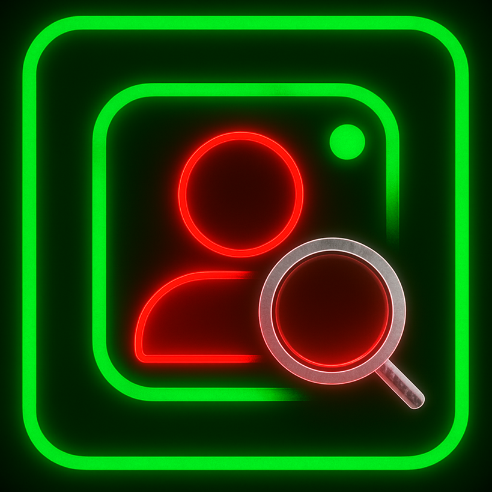

<div align="center">

  <!--  
    
  <a href="https://git.io/typing-svg">
    
  </a>
  -->
  
  <table>
   <td></td>
    <td>
      <!-- Instagram -->
      <a href="https://git.io/typing-svg"></a><br>
      <!-- PrivSniffer -->
      <a href="https://git.io/typing-svg"> </a>
    </td>
  </table>

  <br>
  
  <!-- Badges Row 1 -->
   <!-- PYTHON -->
   <!-- Version -->
  <a href="https://awesome.re" title="Awesome"></a> <!-- Awesome -->
   <!-- Category: OSINT -->
   <!-- License: MIT -->  
   <!-- Stars -->
  <a href="https://t.me/voidologist"></a><!-- Telegram -->
  <a href="https://github.com/obitouka"></a> <!-- Github -->
  <a href="mailto:obitouka@protonmail.com"></a> <!-- ProtonMail -->
   <!-- Forks -->
  
</div>

## FEATURE :

- **`Access private account posts` revealed via collaborating with public account**
- **Download & view media `without login`**

<br>

## INSTALLATION :   
1. **Clone the tool**  
   - Click [here](https://github.com/obitouka/InstagramPrivSniffer/archive/refs/heads/main.zip) to download the ZIP file  
   - *Or* clone the repository via command line:
     ```bash
     git clone https://github.com/obitouka/InstagramPrivSniffer.git
     ```
   
2. **Install dependencies**
   - Navigate to the repository root folder (where requirements.txt is located) in command line and run:
     ```bash
     python -m pip install -r requirements.txt
     ```
  
<br>

## USAGE :  
### View available commands to fetch data
> [!TIP]
> Navigate to the `InstagramPrivSniffer` root folder in a command line and run:
> ```bash
> python main.py -h
> ```

<br>

### How to use those commands
> [!NOTE]
> You have **my permission** to test this command on **my** experimental private Insta account [@keyloggerluvr](https://www.instagram.com/keyloggerluvr) as a proof that tool works.  
>
> Use this to access private account post links
>  ```bash
>  python main.py -n keyloggerluvr
>  ```
>  Or use this to download and view post without login
>  ```bash
>  python main.py -d https://www.instagram.com/keyloggerluvr/p/DL47hX4olz8wRQXBQ4HAaEmba9x7nC9HCSm4M80
>  ```     

<br>


<br>

## DISCLAIMER : 
> [!WARNING]
> This tool neither bypasses any security measures nor Instagram’s policies. It uses Instagram’s [Collaboration feature](https://help.instagram.com/3526836317546926). When a **private account** _collaborates_ with **public account**, those posts get revealed via this tool.

> [!CAUTION]
> **Created for educational purposes only, so please use it ethically. The author is not responsible for any misuse.**

<br>

## CONTRIBUTING : 
If you wish to contribute, please read the [CONTRIBUTING.md](.github/CONTRIBUTING.md) file.

<br>

## LICENSE :
Licensed under the [MIT License](LICENSE) © 2025 [obitouka](https://github.com/obitouka).  
You are free to use, modify, and distribute this project, provided that you **give credit, include the original copyright and license notice**.