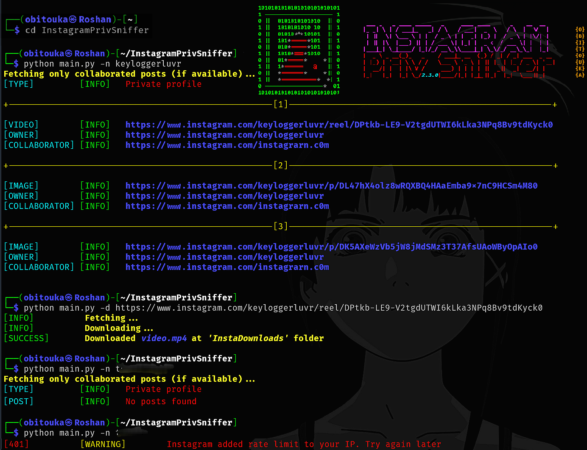

<div align="center">

  <!--  
    
  <a href="https://git.io/typing-svg">
    
  </a>
  -->
  
  <table>
   <td></td>
    <td>
      <!-- Instagram -->
      <a href="https://git.io/typing-svg"></a><br>
      <!-- PrivSniffer -->
      <a href="https://git.io/typing-svg"> </a>
    </td>
  </table>

  <br>
  
  <!-- Badges Row 1 -->
   <!-- PYTHON -->
   <!-- Version -->
  <a href="https://awesome.re" title="Awesome"></a> <!-- Awesome -->
   <!-- Category: OSINT -->
   <!-- License: MIT -->  
   <!-- Stars -->
  <a href="https://github.com/obitouka"></a> <!-- Github -->
  <a href="mailto:obitouka@protonmail.com"></a> <!-- ProtonMail -->
   <!-- Forks -->
  <!-- <a href="https://www.linkedin.com/in/roshansankalpbehera/"></a> <!-- Linkedin -->
  
</div>

## FEATURE :

**Unlock private Instagram posts? Almost.**  
Even if you have **```0% idea about them```**, see what they don’t want you to i.e. every **```collaborated post and who they collaborated with```** from a private account, revealed by colllaborating with a public profile

<br>

## INSTALLATION :   
Click [here](https://github.com/obitouka/InstagramPrivSniffer/archive/refs/heads/main.zip) to download the ZIP file *or* clone the repository using:
    
    git clone https://github.com/obitouka/InstagramPrivSniffer.git

> [!IMPORTANT]
> **Install dependencies** before running this tool
> ```bash
> pip install -r requirements.txt
> ```

<br>

## USAGE :  

> [!TIP]
> Navigate to the InstagramPrivSniffer directory, open a terminal and run it to display the help menu and available CLI arguments:
> ```bash
> python main.py -h
> ```


**EXAMPLE :**
> [!NOTE]
> You have **my permission** to test this command on **my** experimental private Instagram account i.e. [@keyloggerluvr](https://www.instagram.com/keyloggerluvr) as a proof that tool works.
> ```bash
> python main.py -n keyloggerluvr
> ```    

<br>



<br>

## DISCLAIMER : 
> [!WARNING]
> This tool neither bypasses any security measures nor Instagram’s policies. It uses Instagram’s [Collaboration feature](https://help.instagram.com/3526836317546926).

> [!CAUTION]
> **Created for educational purposes only, so please use it ethically. The author is not responsible for any misuse.**

<br>

## CONTRIBUTING : 
If you wish to contribute, please read the [CONTRIBUTING.md](.github/CONTRIBUTING.md) file.

<br>

## LICENSE :
Licensed under the [MIT License](LICENSE) © 2025 [obitouka](https://github.com/obitouka).  
You are free to use, modify, and distribute this project, provided that you **include the original copyright and license notice**.
