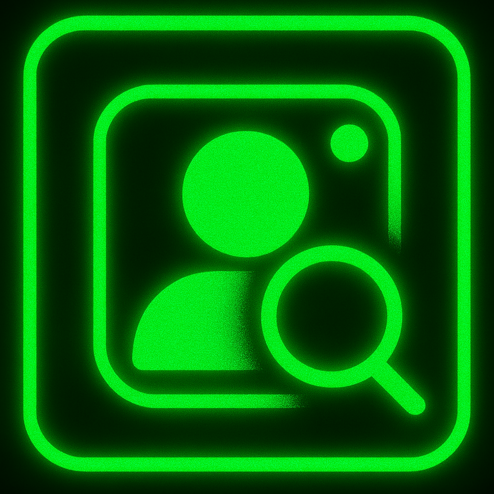

<div align="center">

  <!-- Project Logo -->
  

  <br>
  
  <!-- Badges Row 1 -->
  
  
  
  <a href="https://awesome.re" title="Awesome">  </a>
  

  <br>

  <!-- Badges Row 2 -->
  
  
</div>

## FEATURE

#### Unlock private Instagram posts? Almost.  
Even if you have **```0% idea about them```**, see what they don’t want you to i.e. every **```collaborated post and who they collaborated with```** from a private account, revealed by colllaborating with a public profile **(all without logging in!)**

<br>

## HOW TO USE


<br>

## PROOF

You are **legally authorized** to test this tool on my private Instagram account: [@keyloggerluvr](https://www.instagram.com/keyloggerluvr).
This account is mine, and I give **full consent** for testing purposes only.
> ⚠️ Please use ethically and do not violate Instagram's Terms of Service.

<br>

## PRIVACY & LEGALITY

This tool uses **only publicly accessible data** and does **not bypass** any security mechanisms.  
It relies on the documented behavior of Instagram's [Collaboration feature](https://help.instagram.com/3526836317546926).  
Meta (Instagram) confirms that collaborative posts are **intended to be public**, even if one collaborator has a private account.

<br>

## DISCLAIMER

This project is for **educational and research purposes** only.  
The author is **not responsible for misuse**.  
Please use responsibly and follow Instagram’s Terms of Service.

<br>

## LICENSE

© 2025 [Obitouka](https://github.com/obitouka). All rights reserved.  
This tool is licensed under the **MIT License**.  
If you build upon this project, please give appropriate credit.
